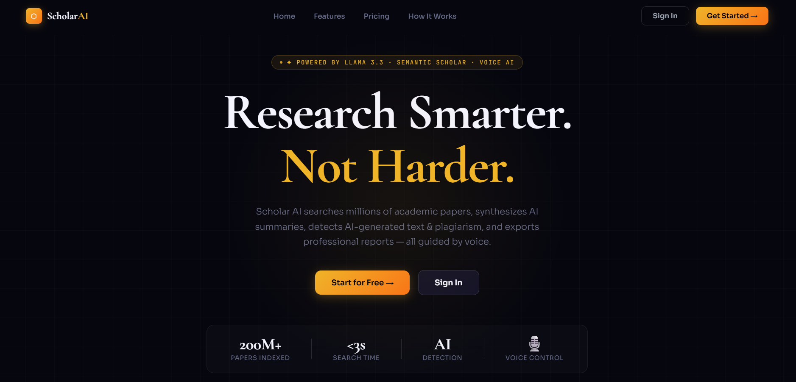
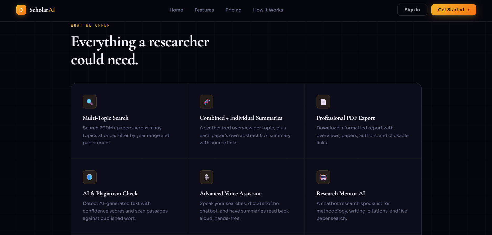
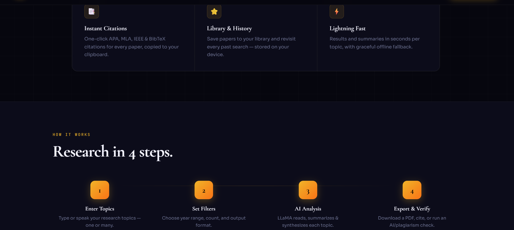

# ⬡ Scholar AI

**An intelligent research agent that searches 200M+ academic papers, synthesizes AI summaries, detects AI-generated text, and exports professional reports all guided by voice.**

[](https://python.org)
[](https://flask.palletsprojects.com)
[](https://groq.com)
[](https://openalex.org)
[](LICENSE)

---

## 📸 Preview







---

## ✨ Features

| Feature | Description |
|---|---|
| 🔍 **Multi-Topic Search** | Search 200M+ papers across multiple topics simultaneously, filtered by year and count |
| 🧬 **AI Summaries** | Synthesized overviews per topic + individual paper summaries via LLaMA 3.3 70B |
| 🛡️ **AI & Plagiarism Check** | Detect AI-generated text with confidence scores; scan passages against published literature |
| 🎙️ **Voice Assistant** | Speak searches, dictate to chatbot, run voice commands, hear summaries read aloud |
| 🤖 **Research Mentor Chatbot** | AI specialist for methodology, literature reviews, writing, citations, and live paper search |
| 📄 **Professional PDF Export** | Formatted reports with overviews, authors, venues, and clickable source links |
| 📑 **Instant Citations** | One-click APA, MLA, IEEE & BibTeX copied to clipboard |
| ⭐ **Library & History** | Save papers and revisit past searches stored locally in browser |
| ⚡ **Reliable by Design** | OpenAlex primary (no API key) + Semantic Scholar fallback + graceful offline mode |

---

## 🧰 Tech Stack

| Layer | Technology |
|---|---|
| Frontend | Single-file HTML/CSS/JS · Web Speech API for voice |
| Backend | Python · Flask · Flask-CORS |
| AI Model | LLaMA 3.3 70B via Groq API |
| Paper Sources | OpenAlex API (250M+ works) · Semantic Scholar (fallback) |
| PDF Export | ReportLab |

---

## 🚀 Quick Start

```bash
# 1. Clone the repository
git clone https://github.com/Hamza-Maqsood1/scholar-ai.git
cd scholar-ai

# 2. Install dependencies
pip install -r requirements.txt

# 3. Set your free Groq API key
# Get one at: https://console.groq.com/keys

# Windows:
setx GROQ_API_KEY "your_key_here"   # then reopen terminal

# macOS / Linux:
export GROQ_API_KEY="your_key_here"

# 4. Run the server
python server.py
```

Then open **http://localhost:5000** and click **"Continue as Demo User"**

> **Demo mode** (no key needed): paper search, PDF export, citations, library, history, voice
> **Full mode** (Groq key): AI summaries, combined overviews, chatbot, AI/plagiarism detection

---

## 🗺️ How It Works

```
Enter Topics → Set Filters → AI Analysis → Export & Verify
(type or speak)  (year, count)  (LLaMA summarizes)  (PDF, citations, checks)
```

---

## 📁 Project Structure

```
scholar-ai/
├── index.html          # Full single-page app landing, auth, dashboard, chat, voice
├── server.py           # Flask API search, summarize, export, chat, AI/plagiarism check
├── requirements.txt    # Python dependencies
└── README.md
```

---

## ⚠️ Notes

- AI detection is probabilistic guidance no detector is 100% accurate
- Plagiarism scan is a similarity indicator across published abstracts, not a definitive report

---

## 👤 Author

**Hamza Maqsood**
BS Artificial Intelligence  University of Management and Technology, Lahore
[](https://linkedin.com/in/hamza-maqsood1)
[](https://github.com/Hamza-Maqsood1)

---

## 📜 License

MIT © Hamza Maqsood
